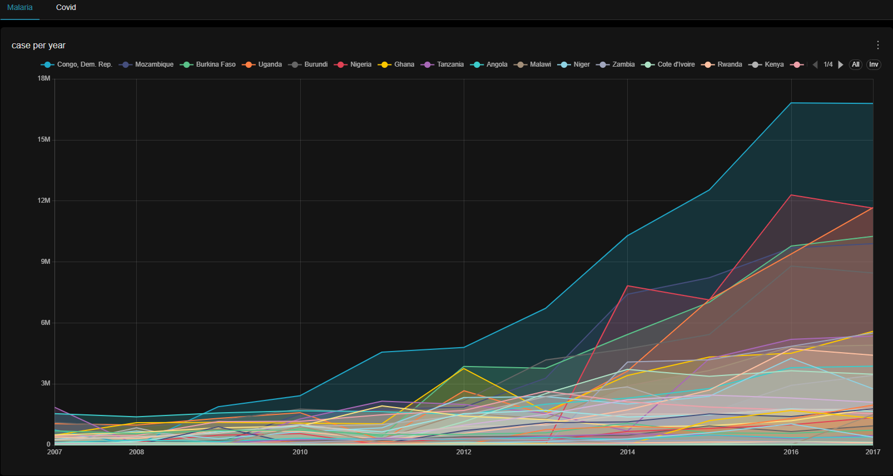

# Projet Data POC - Modern Data Stack

Ce projet est un Proof of Concept (POC) d'une architecture de données moderne ("Modern Data Stack") utilisant Docker pour orchestrer l'ingestion, le stockage, la transformation et la visualisation des données.

## 🏗️ Architecture des Données

L'architecture repose sur le paradigme **Lakehouse** utilisant Apache Iceberg.




```mermaid
    NiFi --> Raw
    Spark -- Read --> Raw
    Spark -- Write --> Warehouse
    Spark -- Catalog --> Postgres
    Trino -- Query --> Warehouse
    Trino -- Metadata --> Postgres
    Superset -- SQL --> Trino
```

### Ingestion & Orchestration (NiFi)

Apache NiFi est utilisé pour ingérer les données brutes dans le bucket `raw` de MinIO.


## 🛠️ Composants de la Stack

| Composant | Rôle | Accès Interface | Identifiants (Défaut) |
| :--- | :--- | :--- | :--- |
| **MinIO** | Stockage S3 (Raw & Lake) | [localhost:9001](http://localhost:9001) | `minioadmin` / `minioadmin123` |
| **Apache NiFi** | Ingestion & Orchestration | [localhost:8443](https://localhost:8443) | `admin` / `admin123wisdom` |
| **PostgreSQL** | Catalogue Iceberg & Metadata | `localhost:5432` | `metadata` / `metadata` |
| **Apache Spark** | Transformation ETL (PySpark) | [localhost:8080](http://localhost:8080) | - |
| **Trino** | Moteur de requêtes SQL | `localhost:8081` | `admin` |
| **Apache Superset** | BI & Visualisation | [localhost:8088](http://localhost:8088) | `admin` / `admin` |

## 🚀 Démarrage Rapide

1.  **Pré-requis** : Docker et Docker Compose installés.
2.  **Configuration** : Vérifiez le fichier `.env` pour les credentials de base.
3.  **Lancer la stack** :
    ```bash
    docker-compose up -d
    ```
4.  **Vérifier le statut** :
    ```bash
    docker-compose ps
    ```

## 📊 Pipelines de Données (Spark)

Les scripts de transformation sont situés dans le dossier `/spark` :

-   **`malaria_to_iceberg.py`** : Nettoie et transforme les données de malaria du bucket `raw` vers la table Iceberg `demo.public.malaria`.
-   **`covid_to_iceberg.py`** : Pipeline similaire pour les données COVID.

**Pour exécuter un job Spark :**
```bash
docker exec -it spark spark-submit --master spark://spark:7077 /opt/spark-apps/malaria_to_iceberg.py
```

## 🔍 Exploration des Données

Une fois les données chargées dans Iceberg, vous pouvez les requêter via **Trino** :
1. Connectez-vous à l'interface Trino ou utilisez un client SQL.
2. Requêtez vos tables : `SELECT * FROM demo.public.malaria LIMIT 10;`.
3. Configurez Trino comme source de données dans **Superset** pour créer vos dashboards.

---
> [!NOTE]
> OpenMetadata est présent dans le `docker-compose.yml` mais nécessite une configuration supplémentaire (Elasticsearch) pour être pleinement fonctionnel.
